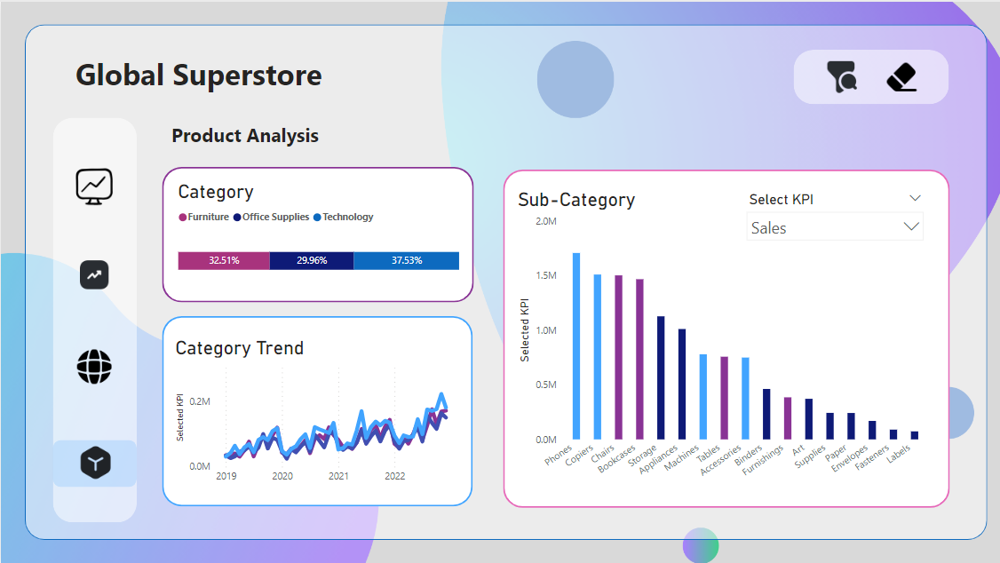

# Global-Super-Store-Report

Discover actionable insights with this Power BI dashboard on the Global Superstore dataset. Dive into dynamic visualizations for sales, profit, and quantity across regions, categories, and customer segments. The interactive map highlights geographic sales distribution, while slicers enable targeted time period & KPI selection for data exploration.

#### Page 1: Main

#### Page 2: Moving Average Trends

#### Page 3: Regional Analysis

#### Page 4: Product Analysis

#### Feel free to contribute to enhance this Power BI dashboard for deeper insights! Suggestions are welcome.

## Click to check out live [Power Bi Report](https://www.novypro.com/project/global-superstore--3)

